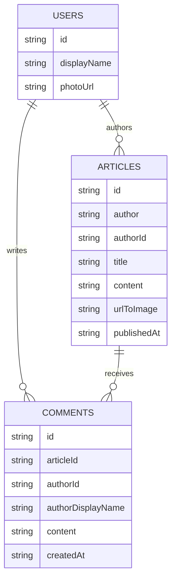

# DB Schema — News App (Firestore + Storage)

Source of truth for field names: `../firestore.rules` (`isValidArticle` / `isValidComment` / `isValidUserProfile`), enforced with `hasOnly([...])`. Dart mapping: `frontend/lib/features/*/data/models/`.

Design: modeled on the NewsAPI article shape (see `ArticleModel.fromJson`), trimmed to what the app needs. NoSQL one-to-squillions pattern — comments live in their own top-level collection with `articleId` inside each comment; articles never embed comment arrays.



## 1. `articles/{articleId}`

Community (user-uploaded) articles. Doc id is the Firestore auto-id; the service writes it back into the `id` field after `add()` (`user_articles_firebase_service.dart`).

| Field | Type | Required | Notes |
|-------|------|----------|-------|
| `id` | string \| null | no | Mirrors doc id. Set post-create. |
| `author` | string \| null | no | Display name. Dart: `authorDisplayName` (`@JsonKey(name: 'author')`). |
| `title` | string \| null | no | Headline. |
| `content` | string \| null | no | Markdown body, rendered with `GptMarkdown`. |
| `urlToImage` | string \| null | no | **Storage download URL** for thumbnail in `media/articles/` (assignment `thumbnailURL` requirement). Null = no image. |
| `publishedAt` | string \| null | no | ISO-8601 string. Sort key, newest first. |
| `authorId` | string \| null | no | Firebase Auth uid of creator. On create must equal `request.auth.uid`. |

Rules: read public. Create requires login + `authorId == auth.uid` + valid shape. Update/delete owner-only (`auth.uid == resource.data.authorId`).

Example:

```json
{
  "id": "aB3x9Q2mZ",
  "author": "Ada Lovelace",
  "authorId": "uid_123",
  "title": "Why offline-first matters",
  "content": "## Intro\nMarkdown body...",
  "urlToImage": "https://firebasestorage.googleapis.com/.../media%2Farticles%2F1700000000_photo.jpg",
  "publishedAt": "2026-09-27T15:00:00.000Z"
}
```

## 2. `comments/{commentId}`

Same id-mirror convention as articles (`comment_firebase_service.dart`). Queried per article, oldest first.

| Field | Type | Required | Notes |
|-------|------|----------|-------|
| `id` | string \| null | no | Mirrors doc id. |
| `articleId` | string | **yes** | Parent article doc id. Query filter. |
| `authorId` | string | **yes** | Must equal `request.auth.uid` on write. |
| `content` | string | **yes** | Comment body. |
| `createdAt` | string | **yes** | ISO-8601 string. Sort key. |
| `authorDisplayName` | string \| null | no | Snapshot for list rendering. |

Rules: read public. Create/update require login + `authorId == uid` + valid shape. Update/delete owner-only.

Example:

```json
{
  "id": "cM8p2R4tY",
  "articleId": "aB3x9Q2mZ",
  "authorId": "uid_456",
  "authorDisplayName": "Alan Turing",
  "content": "Great piece!",
  "createdAt": "2026-09-27T16:00:00.000Z"
}
```

## 3. `users/{uid}`

Public profile for article cards. Doc id **is** the Auth uid; `id` field mirrors it. Email is never stored here (stays in Firebase Auth); delete is disabled.

| Field | Type | Required | Notes |
|-------|------|----------|-------|
| `id` | string | effectively yes | Equals doc id (`uid`). Model defaults to `''` when missing. |
| `displayName` | string \| null | no | Shown on cards; fallback `Anonymous`. |
| `photoUrl` | string \| null | no | Storage download URL for avatar in `media/avatars/{uid}/`. |

Rules: read public. Create/update owner-only (`auth.uid == userId`). No delete.

## 4. Cloud Storage

| Path | Read | Write |
|------|------|-------|
| `media/articles/{timestamp}_{originalName}` | public | authenticated, `image/*` only, `< 5 MB` |
| `media/avatars/{uid}/{fileName}` | public | owner only (`auth.uid == uid`) |
| everything else | denied | denied |

Upload naming: `<millisecondsSinceEpoch>_<originalFileName>` (see `uploadThumbnail`).

## 5. Indexes (`../firestore.indexes.json`)

- `articles`: `authorId ASC + publishedAt DESC` → serves `MyArticles` (`where authorId == uid orderBy publishedAt desc`).
- `comments`: `articleId ASC + createdAt ASC` → serves per-article thread (`where articleId == id orderBy createdAt`).
- Community feed sorts client-side newest-first by `publishedAt` string after `getAllUserArticles()`.

## 6. Deploy / emulate

```bash
cd backend
firebase emulators:start   # Auth :9099, Firestore :8080, Storage :9199
firebase deploy            # pushes firestore.rules + storage.rules + indexes
```
