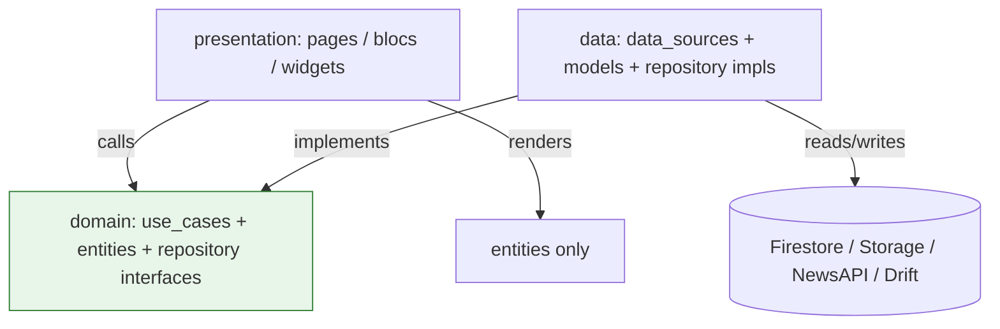
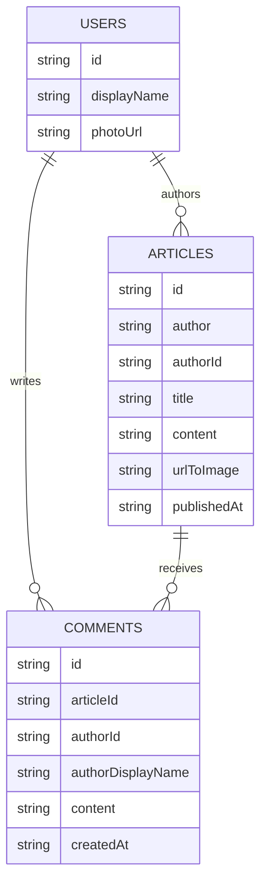
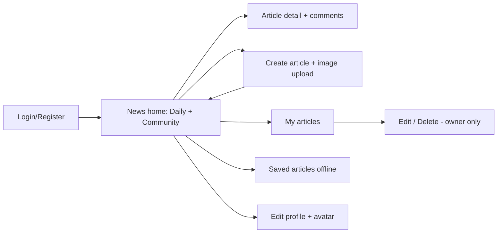

# Applicant Showcase App — Report

> Status: Draft (grill interview in progress — sections marked TODO(you) are unresolved)

## 1. Introduction

I built the Symmetry Applicant Showcase task: a Flutter news app where a journalist can upload their own articles (Firebase backend + Clean Architecture frontend).

I got pretty intimidated by the source code, since I had a lot of problems with the versioning and the Dart concepts themselves — I took the Mobile development course a long time ago, and a lot has changed since then.

## 2. Learning Journey

Technologies I had to (re)learn, roughly in README order:

- **Flutter + Dart refresh.** Dart changed since 2024; relearned null-safety, `flutter pub get`, routes, hooks (`flutter_hooks`), and codegen (`build_runner`, `injectable_generator`, `drift_dev`, `retrofit_generator`).
- **Flutter ↔ Firebase.** Followed the Flutter+Firebase playlist; learned `firebase_core`, `cloud_firestore`, `firebase_storage`, `firebase_auth`, plus `firebase emulators:start` for local work (I had used Firebase before, but never the emulator suite).
- **BLoC / Cubits.** New: `flutter_bloc` blocs vs cubits, events/states with `equatable`, `bloc_test` + `mockito` suites. blocs are the only place that touches use cases.
- **Clean Architecture.** Watched the Clean Architecture tutorial the repo is based on; applied the strict 3-layer `data / domain / presentation` split from `docs/APP_ARCHITECTURE.md`, avoiding the bans in `docs/ARCHITECTURE_VIOLATIONS.md`.
- **Data utilities.** New: `dio` + `retrofit` for NewsAPI, `drift` (migrated from `floor`) + `sqlite3_flutter_libs` for offline saved articles, `image_picker` + `cached_network_image`, `gpt_markdown` for article rendering, `get_it` + `injectable` for DI, `logging`, `awesome_drawer_bar` sidebar.
- **Firestore rules + indexes.** New: writing `firestore.rules` / `storage.rules` validators and composite indexes in `firestore.indexes.json`.

What I actually used most: I watched the MongoDB and Clean Architecture videos in full — they helped me a lot — plus the BLoC, Firebase, and related documentation. I learned new concepts such as the mocking libraries, the code-generation style, device management in my OS and how devices talk to localhost for local testing with the Firebase emulator suite, which was new for me. Overall, it was an exciting learning process.

## 3. Challenges Faced

Real issues hit in this repo (see `docs/notes.md` and git history):

1. **Java OOM + APK path.** Gradle `Xmx1536M` too low for Jetifier; fixed to `Xmx4096M` with `enableJetifier=false`. `rootProject.layout.buildDirectory` pointed at `android/build/app` until explicitly reset to `../build`.
2. **`Equatable.props` null crashes.** `RemoteArticlesState` / `LocalArticlesState` / `LocalArticlesEvent` force-unwrapped nullable fields (`articles!`, `error!`, `article!`); `bloc_test` diagnostic `toString()` crashed on states like `RemoteArticlesLoading`. Fixed by null-safe `props`.
3. **Floor → Drift migration.** Reworked local saved-articles DB (`app_database.dart`, `article_dao.dart`) to Drift.
4. **Saved-article duplicates + privacy.** Added duplicate guard for saved articles; replaced a leaking error message with a generic one.
5. **Owner-only writes.** Iterated `firestore.rules` so updates/deletes require `request.auth.uid == resource.data.authorId`, plus strict `hasOnly([...])` field validation.

What cost me the most time: one UI overflow bug that kept crashing the simulator — I spent a lot of time figuring that out. Also the Floor-to-Drift migration, since I decided to enforce the modern Dart stack, plus getting localhost communication working with my Android device, which wasn't working at all. Lesson learned: check layout constraints and the emulator/device networking setup early instead of assuming the code is at fault.

## 4. Reflection and Future Directions

Technically I leveled up in BLoC state management, Firestore rules/indexes, Drift offline caching, and DI codegen. Professionally the project drilled the Symmetry values: Truth is King (question defaults), Total Accountability (own the bugs), Maximally Overdeliver (extras below).

This project helped me a lot to integrate AI tools into my workflow, and to learn how to do TDD in a proper way — it's amazing how much you can learn in 3 days. Next I would improve the UI design, since I focused on functionality and left the design and beautiful animations a bit aside; I would also add collaboration on articles using the Firebase Realtime Database.

## 5. Proof of the project

Screenshots: [Google Drive folder](https://drive.google.com/drive/folders/1MlfU-OI3MWOTP9R54L8hO1hFRFOs4vsE?usp=sharing) (no demo video).

Coverage in that folder (as captured): news home with Daily News + Community tabs (`news_home_page.dart`), create article with image picker + markdown hint (`create_article_page.dart`), article detail with markdown + comments (`article_detail.dart`), my articles (`my_articles_page.dart`), and edit profile (`edit_profile_page.dart`).

Routes covered: `/`, `/ArticleDetails`, `/SavedArticles`, `/MyArticles`, `/CreateArticle`, `/EditArticle`, `/Login`, `/Register`, `/EditProfile` (see `frontend/lib/config/routes/routes.dart`).

## 6. Overdelivery

Base requirement was: journalist uploads own articles (Firestore schema + `media/articles` thumbnails + rules + Figma UI). Everything below goes beyond that.

### 6.1 New features implemented

| # | Feature | What it does | Where |
|---|---------|--------------|-------|
| 1 | Email/password Auth | Register, login, logout via Firebase Auth; gates create/edit/comment | `features/auth/` (`login_page.dart`, `register_page.dart`, `auth_bloc.dart`), `firebase_auth` |
| 2 | User profiles + avatars | `users/{uid}` docs (`id, displayName, photoUrl`); avatar upload to `media/avatars/{uid}/`; live author avatars on cards | `edit_profile_page.dart`, `user_avatar.dart`, `author_avatar.dart`, `article_author_row.dart` |
| 3 | Community feed tab | Lists all user articles from Firestore alongside NewsAPI daily news | `community_feed_tab.dart`, `daily_news_tab.dart`, `get_all_user_articles.dart` |
| 4 | My Articles page | `authorId == uid` query + composite index; owner entry point to edit/delete | `my_articles_page.dart`, `get_user_articles.dart` |
| 5 | Edit + delete own articles | Update text/image or delete; blocked for non-owners by rules + UI | `edit_article_page.dart`, `update_user_article.dart`, `delete_user_article.dart` |
| 6 | Comments | Per-article post/list/delete (`comments` collection, `articleId` indexed) | `features/comments/` (`comments_section.dart`, `comment_composer.dart`, `comment_tile.dart`, `comments_bloc.dart`) |
| 7 | Saved articles offline | Bookmark NewsAPI + community articles into Drift; dedup guard; Saved page | `saved_article.dart`, `get_saved_article.dart`, `save_article.dart`, `app_database.dart`, `article_dao.dart` |
| 8 | Markdown articles | Write markdown in create/edit; rendered in detail view | `article_detail.dart` (`GptMarkdown`), hints in `create_article_page.dart:346`, `edit_article_page.dart:388` |
| 9 | Image upload pipeline | Pick from gallery, upload to Storage, cache on display | `image_picker`, `user_articles_firebase_service.dart`, `cached_network_image` |
| 10 | Sidebar app shell | Drawer navigation across feeds, saved, my articles, profile | `main_layout.dart`, `sidebar_menu.dart`, `awesome_drawer_bar` |

### 6.2 Prototypes created

- **Firestore schema prototype (implemented):** `articles`, `comments`, `users` collections + `firestore.indexes.json` + `firestore.rules` + `storage.rules`. Written up in `backend/docs/DB_SCHEMA.md` and diagrammed in §7.
- **No separate UML/Figma prototype** was added — Figma prototype from the assignment was converted directly into `news_home_page.dart`, `article_detail.dart`, `create_article_page.dart`, etc.

How to run/test: code generation via the script in `frontend/tool/generate.dart` (per `AGENTS.md`, ask a maintainer to run codegen since the sandbox can't execute Dart), backend via `firebase emulators:start` from `backend/`, and tests with `flutter test`.

Version caution (this bit me): pin the toolchain before running — Dart SDK `>=3.0.0 <4.0.0` (`frontend/pubspec.yaml`), Java 17 (`sourceCompatibility`/`targetCompatibility` and Kotlin `jvmTarget` in `frontend/android/app/build.gradle`), Android Gradle Plugin `9.0.1` with Gradle wrapper `9.1.0`, and the `gradle.properties` memory/Jetifier flags (`-Xmx`, `enableJetifier=false`). Mismatched Java/Gradle/Dart versions break the Android build before any app code runs.

### 6.3 How can you improve this

- Sync saved articles + avatars across devices; offline create queue.
- Search, tags, likes, follow authors.
- Moderation/report flow + Storage thumbnail resizing.
- Replace raw markdown with a rich editor + preview.

## 7. Extra Sections

### 7.1 Architecture (Clean folder)

Rules enforced: domain imports no project code; data is the only layer touching providers; only blocs touch use cases.

### 7.2 Firestore schema (as enforced today)

Storage: `media/articles/{file}` (thumbnails), `media/avatars/{uid}/{file}` (avatars). Indexes: `articles(authorId ASC, publishedAt DESC)`, `comments(articleId ASC, createdAt ASC)`.

### 7.3 Main user flow

