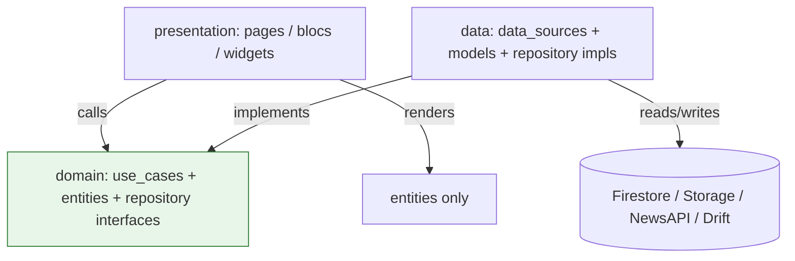
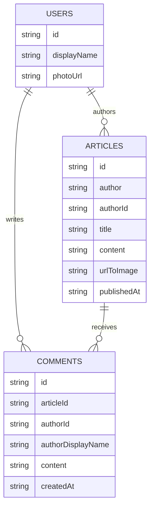
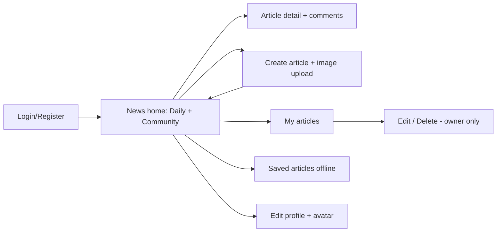

# Applicant Showcase App — Report

I want this report to be a little bit more personal in the parts where I have to give my opinion or personal experience, I hope that my writing skills don't mess up the report, but maybe is an indicator of human effort.

## 1. Introduction

I've used Flutter in one course work and actually, the project for that course was in Kotlin [RouteIQ gh](https://github.com/Intro-CompuMovil/RouteIQ) and later, I built an MVP for other course in Flutter [FipApp gh](https://github.com/FIP-app/FIP).

I was scared about programming in Flutter again, because in those years the AI wasn't good enough to manage such complex projects (at least for the free tools). There were no such AI agents in CLI to support the workload and to mantain the project without breaking everything, but, because of that (the fact that I was programming in Flutter without huge AI help) I saw this project as a big challenge to improve my integration with the tools that we have nowadays. 

A lot changed since the moment that I wrote FIP App (the MVP mentioned before), Dart has become different and has a lot new keywords and features itself.

## 2. Learning Journey

The learning journey for me starts in the first day, looking at the resources and re-visiting the projects that I wrote long time ago, looking at Dart documentation was pretty useful and I had to read a lot in that case.

For RouteIQ I used also Firebase as the primary backend, but I don't remember to be using the rules and the indexes, since for the course work was completely fine to have those in the development mode. Learning about the rules sintax was important to me and took me a big chunk of time.

Other technology that I first used was BLoC state management, in this case, the documentation help me a lot to understand the full architecture of the library and the concepts itself, the BLoCs and Cubits seems to be a clever way to manage the state, and It do it differently from other frameworks for other front-end technologies (such as React Query o Zustand, those libraries are for different languages, but, the concept of BLoC caught my attention).

I saw the videos about TDD and Clean Architecture completely, since I knew them, but I had never applied it to a project before, maybe the TDD development process but in sort of different way and applied to a different technologies. Getting the idea of the Clean Architecture was also a big chunk of my time, since the multiple folders and multiple responsabilities are pretty important each of them, so you have to be clear in the process.

I also saw for the first time the pattern to generate the boilerplate code for example, related to the HTTP client, Dio and retrofit were new to me and the documentation help me a lot to understand that actually, the '.g.dart' files aren't mine, those are generated, along with the floor library, for the SQL database for the cache (later changed to Drift)

The video about the schema design by Mongo DB Youtube channel was pretty good and it was the inspiration to make the Comments feature, since is one of the cases when the one to 'squillions' relationship apply, so, I wanted to test the design in practice.

Other thing that actually caught my attention was the device manager in the OS that I'm using (linux distribution), the Android Studio suite is very good, but in this case, I saw this project as an opportunity to learn how to manage the snapshots and emulators in the terminal. As an example, the Android Debug Bridge (adb) was an important part in this project that I had to learn along with the Firebase emulator suite.

- Because of funny reasons, I had an Android device connected with USB and I notice that actually firebase took off from the free tier the Storage database, so I had to use (and learn) the emulator suite itself. Until I investigated the communication with the localhost from the device, trying to redirect ports using the Android Debug Bridge and trying a lot of things, I figure it out that the easiest way was just use an emulator in the system.
    - That was also fun, because I learned how to pass files using the Android Debug Bridge, use KVM for the emulators and how to clean up the device filesystem in order to see the changes in the SQL database DDL.

It was pretty fun in overall, I learned a lot (I will keep my comments for the reflection section).

## 3. Challenges Faced

### Versions and SDK

The big first challenge I'd say was the versions of the SDK and the target Android application, because it seems that Flutter is migrating to some built-in kotlin installation for the [Android devices](https://docs.flutter.dev/release/breaking-changes/migrate-to-built-in-kotlin/for-app-developers) and I really care about using the latest versions of the SDK: Dart, Flutter, Android and so on. But the existing dependencies were dragging me to downgrade the versions (or update the packages used). That's the case with Floor, as the project use Dio and retrofit to generate the code for the HTTP client (and later mockito for the test mocks), then, after a lot of hours I managed to make the application work, migrating from Floor to Drift for the SQL, but I was in a loop of getting the dependencies missmatch and looking for alternatives to do not down grade the Dart version.

Also I spent some time in the gradle configuration thanks to the Android target version and some issues with the built-in kotlin. This comes also with Gradle version, the config files change a lot the sintax between versions.

I'd that actually it's something that is unnecessary, and consumes a lot of time (maybe in this case was a mistake from me?) but I think that in a real project, mantaining the SDK updated is a privilege that a lot of long-term projects want to achieve, since in a long term project you care about production and stability, but you loose the newest features in your tech stack. 

So, I see this piece of work necessary to learn how to manage this kind of dependencies and upgrading the packages in the Flutter environment, since it envoles also the Android toolchain and dependencies. In that case, in the future, I have a lot of more experience upgrading this toolchain and looking for alternatives in the packages used by old SDKs versions.

I'm not saying that sticking to one stable version is bad (because actually for production I saw this as a good practice) but when you have the opportunity to use the latest versions of the SDK that you're using, you have to take it and exploit the new performance or features that the SDK comes with.

### The Java OOM

I spent a big chunk of time debugging why the application was crashing without even start, I was suspecting about something related with the Gradle version since before I was fixing the sintax of the config files, but It was just the heap allocation: I had to give more resources to the Java compilation process to be success.

Gradle `Xmx1536M` too low for Jetifier; fixed to `Xmx4096M` with `enableJetifier=false`

### Floor and Drift

When the floor package was giving a lot of troubles in the dependency resolution, I took the decision to look at some alternatives, I found Drift that I consider the best as the project describes itself as the direct replacement of Floor. But understanding the migration and reading the documentation of Drift was some big part of this challenge, since the AI can migrate everything (yes) but you have to understand it to judge the changes later.

### The overflow crash

What cost me the most time: one UI overflow bug that kept crashing the emulator (????).

- Actually, I'm still investigating this thing, I was using a Small Phone emulator since the RAM was a problem for me, but it was actually annoying that Flutter shows an overflow mark when exist one in debug mode, well, it seems that the overflow mark was heavier than the entire application and trigger a segmentation fault in the emulator.

- I fixed that with lucky I guess, was literally the last thing that I considered to fix that.

## 4. Reflection and Future Directions

Beyond the opportunity to take this technical test for a company, this was a real learning experience. I'm going to be honest, I'm comming from the side of algorithmic programming contests, where you have 3-5 hours to solve problems using algorithms and computer science relate stuff, a couple of years ago, I participated in some Hackathons and I lost the interest in hackathons, but making this tech test, I realized that you learn A LOT doing hackathons (I looking this test as a hackathon). It depends in the area or the product that you're working on, you gain a lot of practical experience from developing a product from scratch and facing all the technical and design challenges that may present to you.

But besides the learning statement, I'm also shocked by the things that we can build nowadays with AI.

The speed of development (at least for an MVP) is lightning fast compared to two years ago, looking at my colleagues submissions, it's amazing the things that we can do for the software industry in such short time. How we can imporve a simple project and a simple product and how the design is taking more importance nowadays.

But still, you have to code by yourself to really understand and actually to notice what is happening behind, with the tools that we have, this is the moment that we can improve the underlying infrastructure to make a product or software better, because we have the responsability to deliver a good product to the world, and keep practicing about design and people, because is what matters now and in the future.

This project has contributed to my growth as a developer, thanks!

---

As future directions for this projects, I'd to implement the real time collaboration when you create an article, that could be awesome and make use of the Real Time Database that Firebase has.

## 5. Proof of the project

Screenshots: [Google Drive folder](https://drive.google.com/drive/folders/1MlfU-OI3MWOTP9R54L8hO1hFRFOs4vsE?usp=sharing).

Demo video: [Tella video](https://www.tella.tv/video/symmetry-test-demo-video-cbvz)
Backup if Tella don't [work](https://drive.google.com/file/d/1TW4-Q8Mxfsc6w1DxgyvsZBRna0aj7iB4/view?usp=sharing)

Routes covered: `/`, `/ArticleDetails`, `/SavedArticles`, `/MyArticles`, `/CreateArticle`, `/EditArticle`, `/Login`, `/Register`, `/EditProfile` (see `frontend/lib/config/routes/routes.dart`).

## 6. Overdelivery

Base requirement was: journalist uploads own articles (Firestore schema + `media/articles` thumbnails + rules + Figma UI). Everything below goes beyond that.

### 6.1 New features implemented

| # | Feature | What it does | Where |
|---|---------|--------------|-------|
| 1 | Email/password Auth | Register, login, logout via Firebase Auth; gates create/edit/comment | `features/auth/` (`login_page.dart`, `register_page.dart`, `auth_bloc.dart`), `firebase_auth` |
| 2 | User profiles + avatars | `users/{uid}` docs (`id, displayName, photoUrl`); avatar upload to `media/avatars/{uid}/`; live author avatars on cards | `edit_profile_page.dart`, `user_avatar.dart`, `author_avatar.dart`, `article_author_row.dart` |
| 3 | Community feed tab | Lists all user articles from Firestore alongside NewsAPI daily news | `community_feed_tab.dart`, `daily_news_tab.dart`, `get_all_user_articles.dart` |
| 4 | My Articles page | `authorId == uid` query + composite index; owner entry point to edit/delete | `my_articles_page.dart`, `get_user_articles.dart` |
| 5 | Edit + delete own articles | Update text/image or delete; blocked for non-owners by rules + UI | `edit_article_page.dart`, `update_user_article.dart`, `delete_user_article.dart` |
| 6 | Comments | Per-article post/list/delete (`comments` collection, `articleId` indexed) | `features/comments/` (`comments_section.dart`, `comment_composer.dart`, `comment_tile.dart`, `comments_bloc.dart`) |
| 7 | Saved articles offline | Bookmark NewsAPI + community articles into Drift; dedup guard; Saved page | `saved_article.dart`, `get_saved_article.dart`, `save_article.dart`, `app_database.dart`, `article_dao.dart` |
| 8 | Markdown articles | Write markdown in create/edit; rendered in detail view | `article_detail.dart` (`GptMarkdown`), hints in `create_article_page.dart:346`, `edit_article_page.dart:388` |
| 9 | Image upload pipeline | Pick from gallery, upload to Storage, cache on display | `image_picker`, `user_articles_firebase_service.dart`, `cached_network_image` |
| 10 | Sidebar app shell | Drawer navigation across feeds, saved, my articles, profile | `main_layout.dart`, `sidebar_menu.dart`, `awesome_drawer_bar` |

### 6.2 Prototypes created

- **Firestore schema prototype (implemented):** `articles`, `comments`, `users` collections + `firestore.indexes.json` + `firestore.rules` + `storage.rules`. Written up in `backend/docs/DB_SCHEMA.md` and diagrammed in §7.
- **No separate UML/Figma prototype** was added — Figma prototype from the assignment was converted directly into `news_home_page.dart`, `article_detail.dart`, `create_article_page.dart`, etc.

How to run/test: code generation via the script in `frontend/tool/generate.dart`, backend via `firebase emulators:start` from `backend/`, and tests with `flutter test`.

### 6.3 How can you improve this

- Sync saved articles + avatars across devices; offline create queue.
- Search, tags, likes, follow authors.
- Moderation/report flow + Storage thumbnail resizing.
- Replace raw markdown with a rich editor + preview.

## 7. Extra Sections

### 7.1 Architecture (Clean folder)

### 7.2 Firestore schema 

Storage: `media/articles/{file}` (thumbnails), `media/avatars/{uid}/{file}` (avatars). Indexes: `articles(authorId ASC, publishedAt DESC)`, `comments(articleId ASC, createdAt ASC)`.

### 7.3 Main user flow

### 7.4 Test coverage 

Counted from source on this branch (generated `*.g.dart`/`*.mocks.dart` excluded from `lib/`): **45 test files** (+24 mock files), **135 unit cases** (`test()`), **68 widget cases** (`testWidgets()`), 10 files using `blocTest` — **203 cases total.**

| Feature | data | domain | presentation |
|---|---|---|---|
| news | 5 files | 6 files | 16 files |
| auth | 3 files | 2 files | 6 files |
| comments | 2 files | 2 files | 2 files |
| home | — | — | 1 file |
